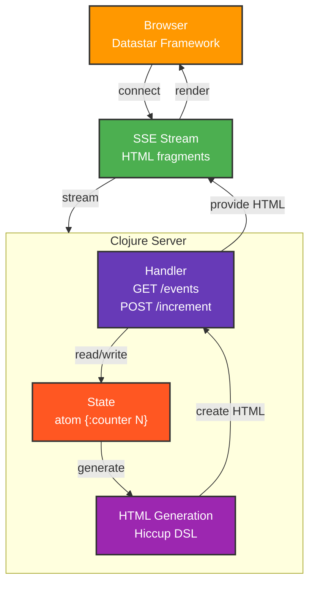
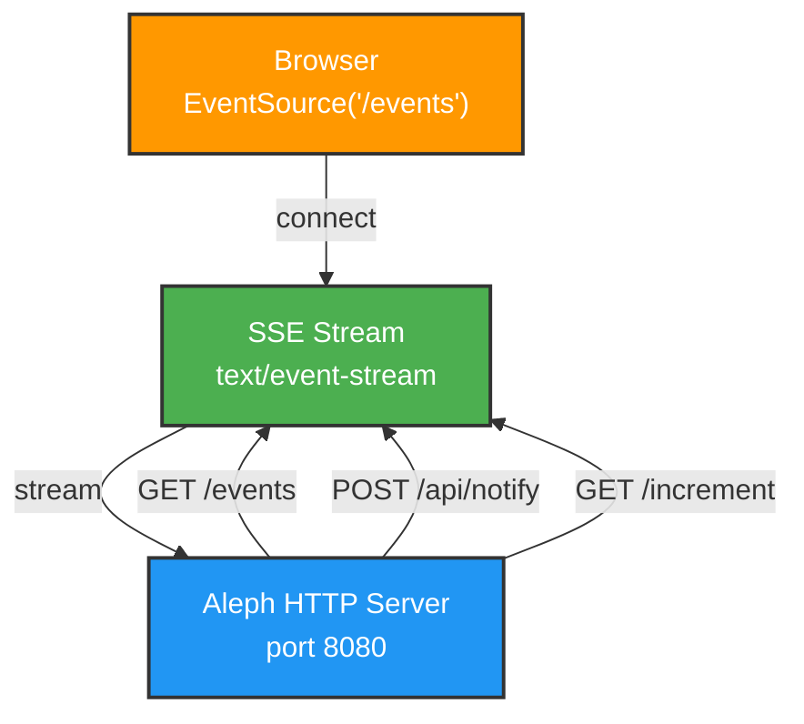
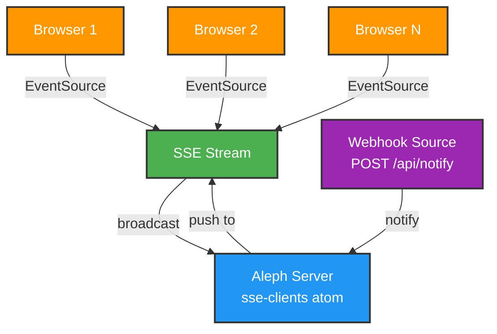

# clj-star-bridge

React SPA から **Datastar + Clojure** へのアーキテクチャ移行を段階的に実現するための実験プロジェクト。

既存の重い JavaScript フレームワークから脱却し、サーバー主導のシンプルで軽量なリアルタイム Web アプリケーションへの「架け橋」となることを目指しています。

## 📌 プロジェクトの目的

| 項目 | React SPA | Datastar + Clojure |
|------|-----------|------------------|
| フロントエンド | 重い（React, Vue など） | 軽量（11KB） |
| 状態管理 | クライアント側（useState） | サーバー側（Atom） |
| ビルド | 必須（npm, webpack） | 不要 |
| 更新方式 | 仮想 DOM の差分検出 | SSE による部分更新 |
| 開発体験 | npm ビルド待機 | REPL 駆動開発 |

## ✅ 実装進捗

### Phase 1: SSE Notification System ✅ COMPLETE

リアルタイム通知システムの基盤を構築。

**実装済み:**
- ✅ Browser EventSource 接続（`/events` endpoint）
- ✅ Webhook による通知受信（`POST /api/notify`）
- ✅ 複数クライアントへのブロードキャスト
- ✅ カウンター画面（`/increment` endpoint）
- ✅ Aleph HTTP サーバー（ネイティブ SSE サポート）
- ✅ エラーハンドリングと接続管理

**技術スタック (Phase 1):**
- **Aleph 0.4.7**: ネイティブ SSE 対応の Async HTTP サーバー
- **Manifold**: ストリーム管理ライブラリ
- **Hiccup 2.0.0**: Clojure のデータ構造から HTML を生成
- **Cheshire**: JSON パース・生成
- **Clojure 1.12.0**: コア言語

### Phase 2: Datastar Components ✅ COMPLETE

**Datastar とは？**
軽量フロントエンドフレームワーク（11KB）。サーバーからの SSE ストリームを通じて、HTML フラグメントを受け取り、**部分的に DOM を更新** するアプローチ。
React の仮想 DOM 比較ではなく、サーバーが「どの部分を更新するか」を明示的に指定します。

**実装状況:**
- [x] Datastar スクリプトと Clojure/Aleph SDK の統合
- [x] Hiccup で生成した HTML フラグメントを SSE で送信
- [x] サーバー生成した `#counter-panel` 全体の差し替え
- [x] 1 レスポンスで複数の UI fragment を更新
- [x] signals を使ったクライアント状態との連携

**SSE 実装の位置づけ:**

このプロジェクトでは、意図的に 2 種類の SSE 実装を併存させています。

- `/events`: Aleph/Manifold で手書きした汎用 EventSource 向け SSE。SSE の原理が見える参考実装として残す。
- Datastar actions（例: `/increment`）: `dev.data-star.clojure/aleph` と Datastar SDK を使い、DOM patch や signal patch などの Datastar プロトコルを任せる。

Aleph は Datastar 専用ではなく、SSE/streaming を扱うための Clojure HTTP サーバー基盤として採用しています。Datastar 固有のイベント生成は SDK に寄せ、手書き SSE は汎用通知ストリームと学習用の低レベル実装として扱います。

`/events` と `/live-status` はどちらも長時間 SSE 接続ですが、駆動方式は異なります。`/events` は webhook や counter 更新などの外部イベントが起きた時だけ JSON を broadcast するイベント駆動の手書き SSE です。`/live-status` は接続ごとに Datastar SDK の SSE generator と virtual thread を持ち、1 秒ごとに DOM patch を送る周期実行型の Datastar SSE です。

### Phase 3: React Component Gradual Migration (進行中)

- [x] Datastar SDK による長時間 SSE stream の新規評価
  - 既存の `/events` は手書き JSON SSE の参考実装として維持する
  - 別エンドポイント `/live-status` で、サーバー時刻と更新回数を DOM patch として継続送信する
  - 長時間処理は virtual thread で実行し、クライアント切断時に停止する
- [ ] 既存 React SPA の段階的置き換え
- [ ] 状態管理の Clojure 移行

### Phase 4: Full Clojure SSR (計画中) - 最終形イメージ

**焦点：アプリケーション層 - 状態管理とHTMLレンダリング**



**最終目標:**
- ✅ 完全サーバーサイドレンダリング
- ✅ React 完全削除
- ✅ ビルドプロセス不要
- ✅ REPL 駆動開発でリアルタイム更新

## 🚀 クイックスタート

### WSLc コンテナで起動（推奨）

開発ツールは Windows 側ではなく WSLc コンテナ内に寄せます。

```powershell
cd C:\dev\clj-star-bridge
wslc build -t clj-star-bridge-dev:latest -f containers/clj-dev/Dockerfile .
wslc run -v C:\dev\clj-star-bridge:/workspace -p 8080:8080 -it clj-star-bridge-dev:latest bash
```

コンテナ内で：

```bash
clj -M -m clj-star-bridge.core
```

ブラウザで [http://localhost:8080](http://localhost:8080) を開くと、SSE 通知システムが表示されます。

Windows 上のチェックアウトはコンテナ内の `/workspace` にマウントされます。bash や Clojure REPL でインタラクティブに試す手順は [`containers/clj-dev/BUILD.md`](containers/clj-dev/BUILD.md) を参照してください。

### Windows で直接起動

#### 前提
- **Clojure** がインストール済み（`clj` コマンド）
- **Java** 11 以上

#### セットアップ

```bash
# リポジトリをクローン
git clone https://github.com/your-org/clj-star-bridge.git
cd clj-star-bridge

# サーバー起動
clj -M -m clj-star-bridge.core
```

ブラウザで [http://localhost:8080](http://localhost:8080) を開くと、SSE 通知システムが表示されます。

## 📊 アーキテクチャ

### Phase 1: Core SSE Infrastructure

**焦点：通信層 - 複数クライアントのSSE接続管理**



### 通信フロー

**複数クライアント接続の管理方法**



## 🧪 テスト

### Webhook 通知テスト

サーバー起動後、別ターミナルで：

```bash
curl -X POST http://localhost:8080/api/notify \
  -H "Content-Type: application/json" \
  -d '{"message":"✅ テスト通知"}'
```

ブラウザに **青色** の "✅ テスト通知" が表示されます。

### カウンター機能テスト

ブラウザで "+1" ボタンをクリックするとカウンターが増加します。

## 📚 参考資料

- 📖 [Datastar 公式ドキュメント](https://data-star.dev)
- 💻 [Aleph Documentation](https://aleph.io/)
- 🎯 [Manifold Streams](https://github.com/clj-commons/manifold)

## 📝 ライセンス

MIT
