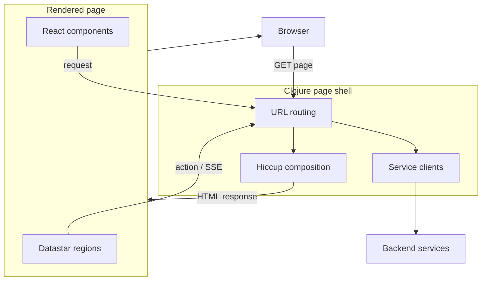
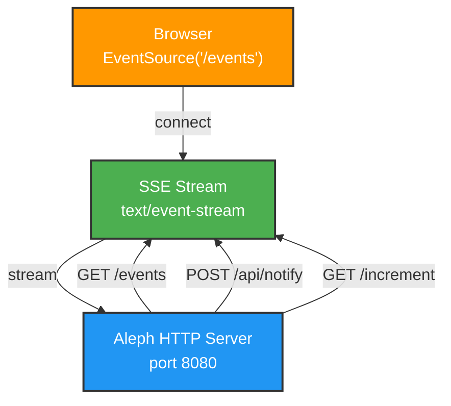
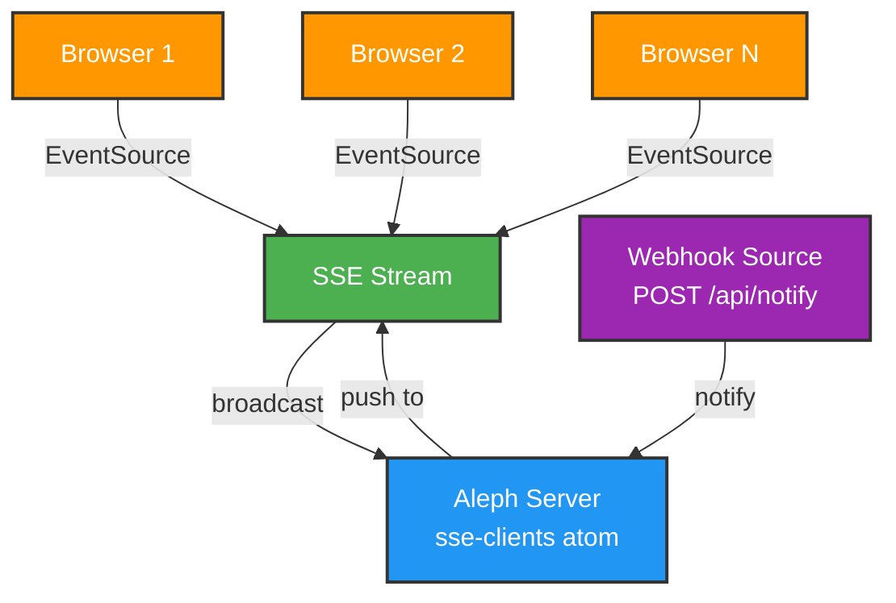

# clj-star-bridge

モノリシックな React SPA + 単一デプロイ境界の Spring Boot REST backend から、**Clojure/Hiccup がページを構成し、Datastar と React コンポーネントが共存する構成**への段階的な移行を検証するプロジェクト。

React Router と feature ごとの Zustand store 群がブラウザ内で担っている画面・データ区画の制御を、サーバー側の URL・ページ・サービス境界へ移すことを目指します。React は廃止せず、複雑なクライアント UI を担当するページ内コンポーネントとして残します。

## 📌 プロジェクトの目的

| 関心事 | 現在のモノリシック SPA | 目標構成 |
|------|--------------------------|----------|
| ページ制御 | React Router | サーバーの URL routing と Hiccup |
| 画面・データ区画 | React Router と Zustand store 群 | URL、page context、backend service |
| ページ内 UI | React がページ全体を管理 | Datastar と React component を適材適所で利用 |
| 業務データ | 内部に業務別構造を持つ単一デプロイの Spring Boot backend | 明示した service 境界が所有し、必要な場合だけ独立デプロイ |
| JavaScript build | SPA 全体を build | React component に必要な範囲だけ build |

詳細な目標構成と責任分担は [`docs/TARGET_ARCHITECTURE.md`](docs/TARGET_ARCHITECTURE.md) を参照してください。

## ✅ 実装進捗

### Phase 1: SSE Notification System ✅ COMPLETE

リアルタイム通知システムの基盤を構築。

**実装済み:**
- ✅ Browser EventSource 接続（`/events` endpoint）
- ✅ Webhook による通知受信（`POST /api/notify`）
- ✅ 複数クライアントへのブロードキャスト
- ✅ カウンター画面（`/increment` endpoint）
- ✅ Aleph HTTP サーバー（ネイティブ SSE サポート）
- ✅ エラーハンドリングと接続管理

**技術スタック (Phase 1):**
- **Aleph 0.4.7**: ネイティブ SSE 対応の Async HTTP サーバー
- **Manifold**: ストリーム管理ライブラリ
- **Hiccup 2.0.0**: Clojure のデータ構造から HTML を生成
- **Cheshire**: JSON パース・生成
- **Clojure 1.12.0**: コア言語

### Phase 2: Datastar Components ✅ COMPLETE

**Datastar とは？**
軽量フロントエンドフレームワーク（11KB）。サーバーからの SSE ストリームを通じて、HTML フラグメントを受け取り、**部分的に DOM を更新** するアプローチ。
React の仮想 DOM 比較ではなく、サーバーが「どの部分を更新するか」を明示的に指定します。

**実装状況:**
- [x] Datastar スクリプトと Clojure/Aleph SDK の統合
- [x] Hiccup で生成した HTML フラグメントを SSE で送信
- [x] サーバー生成した `#counter-panel` 全体の差し替え
- [x] 1 レスポンスで複数の UI fragment を更新
- [x] signals を使ったクライアント状態との連携

**SSE 実装の位置づけ:**

このプロジェクトでは、意図的に 2 種類の SSE 実装を併存させています。

- `/events`: Aleph/Manifold で手書きした汎用 EventSource 向け SSE。SSE の原理が見える参考実装として残す。
- Datastar actions（例: `/increment`）: `dev.data-star.clojure/aleph` と Datastar SDK を使い、DOM patch や signal patch などの Datastar プロトコルを任せる。

Aleph は Datastar 専用ではなく、SSE/streaming を扱うための Clojure HTTP サーバー基盤として採用しています。Datastar 固有のイベント生成は SDK に寄せ、手書き SSE は汎用通知ストリームと学習用の低レベル実装として扱います。

`/events` と `/live-status` はどちらも長時間 SSE 接続ですが、駆動方式は異なります。`/events` は webhook や counter 更新などの外部イベントが起きた時だけ JSON を broadcast するイベント駆動の手書き SSE です。`/live-status` は接続ごとに Datastar SDK の SSE generator と virtual thread を持ち、1 秒ごとに DOM patch を送る周期実行型の Datastar SSE です。

### Phase 3: Hiccup Shell + React Component Integration (進行中)

この段階では、最終的なページ・service 境界への分解に先立ち、既存 React
application を 1 つの React root として Hiccup shell に収容できることを確認する。
これは React 公式の既存ページ統合方式と同じ mount 技術を、移行の入口として
利用するもの。今回の PoC は構成上の接続確認であり、application boundary の
移行完了を意味しない。

- [x] Datastar SDK による長時間 SSE stream の新規評価
  - 既存の `/events` は手書き JSON SSE の参考実装として維持する
  - 別エンドポイント `/live-status` で、サーバー時刻と更新回数を DOM patch として継続送信する
  - 長時間処理は virtual thread で実行し、クライアント切断時に停止する
- [ ] Azure App Service の実経路で長時間 SSE 接続を検証
  - 接続直後に初期 event を送信し、無通信時は heartbeat で idle timeout を避ける
  - 切断後の自動再接続と状態復元を確認する
  - 業務 event と接続維持用 heartbeat の送信間隔を分離する
- [x] Hiccup、Datastar、React、backend service の責任分担を定義
- [x] Hiccup ページに `clj-react-hack` の demo application を 1 つの React root として mount
- [x] Datastar と React の DOM 所有範囲を分離
- [x] full-page reload でページ固有 state が破棄・再構築されることを確認
- [ ] `tradehub-web-frontend` を既存 SPA のまま Hiccup shell に収容して動作確認
- [ ] `tradehub-web-backend` の event を bridge で受け、React root 外の Datastar 通知領域へ push
- [ ] 実システムの認証、routing、asset 配信境界を確認

### Phase 4: Application Boundary Migration (計画中)

**焦点：React SPA 内の仮想的な画面・データ区画を、サーバーのページ・サービス境界へ移す**



**最終目標:**
- サーバーが URL、ページ構成、認証境界、service 連携を制御する
- Datastar はサーバー主導 UI、React は複雑なクライアント UI を担当する
- React component は割り当てられた DOM の内側だけを管理する
- 業務データと業務ロジックは backend service が所有する
- service 分割は実際の業務境界と独立運用の必要性が確認できた箇所に限定する

## 🚀 クイックスタート

### WSLc コンテナで起動（推奨）

開発ツールは Windows 側ではなく WSLc コンテナ内に寄せます。

```powershell
cd C:\dev\clj-star-bridge
wslc build -t clj-star-bridge-dev:latest -f containers/clj-dev/Dockerfile .
wslc run --name clj-star-bridge-dev `
  -v C:\dev\clj-star-bridge:/workspace `
  -v C:\dev\clj-react-hack:/workspace-react `
  -p 8080:8080 `
  -p 3000:3000 `
  -p 9630:9630 `
  -it clj-star-bridge-dev:latest bash
```

コンテナ内で：

```bash
clj -M -m clj-star-bridge.core
```

ブラウザで [http://localhost:8080](http://localhost:8080) を開くと、SSE 通知システムが表示されます。

Windows 上のチェックアウトはコンテナ内の `/workspace` にマウントされます。bash や Clojure REPL でインタラクティブに試す手順は [`containers/clj-dev/BUILD.md`](containers/clj-dev/BUILD.md) を参照してください。

### React component 統合 PoC

`clj-react-hack` も Windows の `C:\dev\clj-react-hack` にチェックアウトし、
同じ WSLc コンテナへ `/workspace-react` としてマウントします。別の
PowerShell ターミナルから同じコンテナへ入ります。

```powershell
wslc exec -it clj-star-bridge-dev bash
```

2つ目のコンテナシェルで Nix 開発環境へ入り、Shadow-CLJS development
server を起動します。

```bash
nix develop /opt/clj-star-bridge-dev --command bash -i
cd /workspace-react
npm ci
npm run build:css
npx shadow-cljs watch app \
  --config-merge /workspace/containers/clj-dev/shadow-cljs-wslc.edn
```

`clj-star-bridge` は既定で `http://localhost:3000/output.css` と `http://localhost:3000/js/main.js` を読み込み、Hiccup が生成した `#app` に React component を mount します。Shadow-CLJS は React 側の lockfile に固定された版を使い、コンテナイメージへグローバルインストールしません。詳しい起動・再接続手順は [`containers/clj-dev/BUILD.md`](containers/clj-dev/BUILD.md) を参照してください。

配信元を変える場合は、`CLJ_REACT_ASSET_BASE_URL` を指定してから Clojure server を起動します。

```bash
CLJ_REACT_ASSET_BASE_URL=https://example.invalid/assets/clj-react-hack \
  clj -M -m clj-star-bridge.core
```

### Windows で直接起動

#### 前提
- **Clojure** がインストール済み（`clj` コマンド）
- **Java** 11 以上

#### セットアップ

```bash
# リポジトリをクローン
git clone https://github.com/your-org/clj-star-bridge.git
cd clj-star-bridge

# サーバー起動
clj -M -m clj-star-bridge.core
```

ブラウザで [http://localhost:8080](http://localhost:8080) を開くと、SSE 通知システムが表示されます。

## 📊 アーキテクチャ

### Phase 1: Core SSE Infrastructure

**焦点：通信層 - 複数クライアントのSSE接続管理**



### 通信フロー

**複数クライアント接続の管理方法**



## 🧪 テスト

### Webhook 通知テスト

サーバー起動後、別ターミナルで：

```bash
curl -X POST http://localhost:8080/api/notify \
  -H "Content-Type: application/json" \
  -d '{"message":"✅ テスト通知"}'
```

ブラウザに **青色** の "✅ テスト通知" が表示されます。

### カウンター機能テスト

ブラウザで "+1" ボタンをクリックするとカウンターが増加します。

## 📚 参考資料

- 📖 [Datastar 公式ドキュメント](https://data-star.dev)
- 💻 [Aleph Documentation](https://aleph.io/)
- 🎯 [Manifold Streams](https://github.com/clj-commons/manifold)

## 📝 ライセンス

MIT
